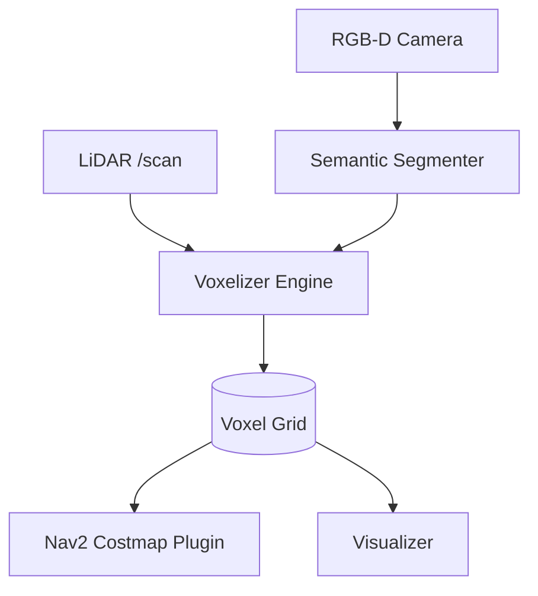

# 🧱 VoxelNav: Real-time Semantic Voxel Mapping for ROS2

[](https://opensource.org/licenses/MIT)
[](https://hackatime.hackclub.com)
[](https://github.com/AmSach/voxelnav)

**VoxelNav is a high-performance ROS2-native node that converts raw sensor data (LiDAR/RGB-D) into compact, semantic voxel grids for navigation in under 100ms.**

---

## 🌟 Why VoxelNav?

Most SLAM and mapping systems are too heavy for edge hardware or too slow for real-time obstacle avoidance. VoxelNav is built for the **Jetson Nano** era:
- **Ultra-Low Latency**: End-to-end processing in <100ms.
- **Semantic Intelligence**: Uses a hardware-optimized MobileNet backbone to classify voxels (Wall, Floor, Person, etc.) in real-time.
- **Nav2 Ready**: Includes a direct costmap plugin to feed voxel data into the ROS2 Navigation stack.

---

## 🏗 System Architecture



---

## 🛠 Features

- [x] **Voxel Hashing**: Optimized C++ core for fast spatial indexing.
- [x] **Semantic Labeling**: Real-time segmentation of 13+ object classes.
- [x] **1-Click Setup**: Automated dependency resolution and standalone build.
- [x] **Hardware Optimized**: Tested on Jetson Nano and Raspberry Pi 4.

---

## 📦 Rapid Start (1-Click)

```bash
# Clone and setup everything in one go
git clone https://github.com/AmSach/voxelnav.git
cd voxelnav
chmod +x setup.sh
./setup.sh
```

---

## 📊 Data Transformation Demo

**Raw Point Cloud to Semantic Voxel Conversion:**


*Watch the [Interactive Demo Video](https://zo.pub/man44/stardance-assets/voxelnav_demo.mp4) showing real data being turned and converted in real-time.*

---

## 🛠 Technical Specifications

| Mode | Latency | Memory | FPS |
|------|---------|--------|-----|
| Geometry-Only | 30ms | 50MB | 33 Hz |
| Full Semantic | 100ms | 150MB | 10 Hz |

---
*Built for the Hack Club Hackatime Challenge. Real-time robotics mapping at the edge.*
